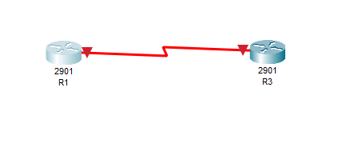
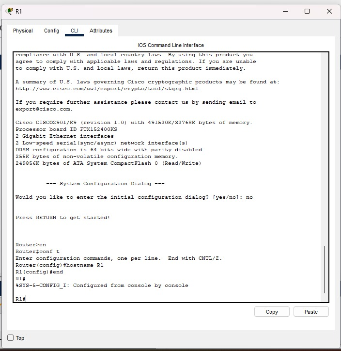
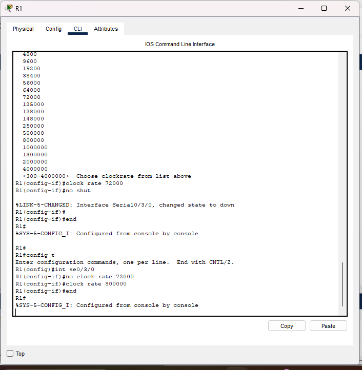
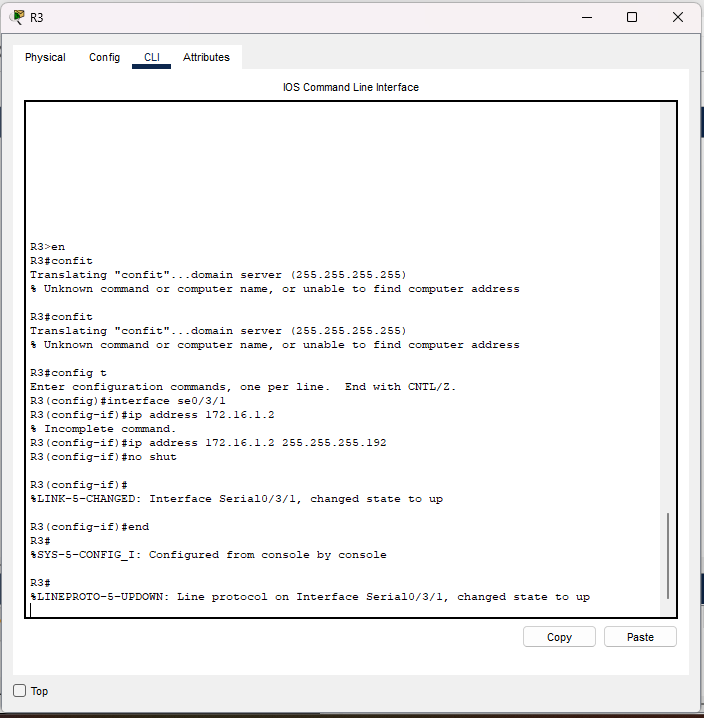
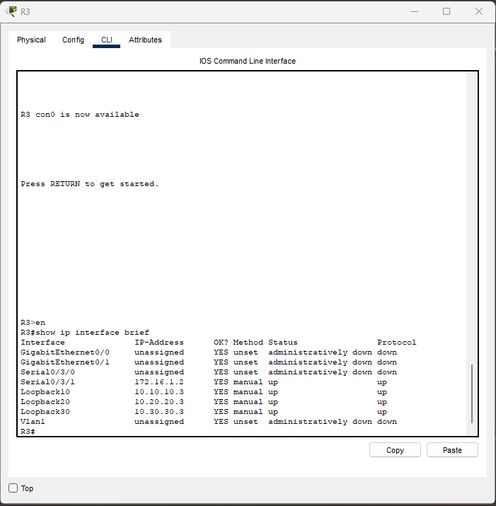
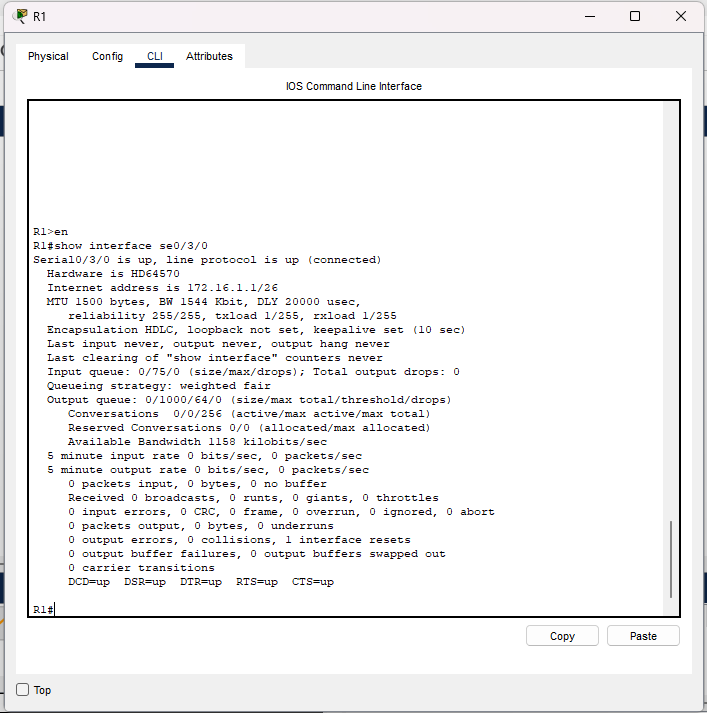
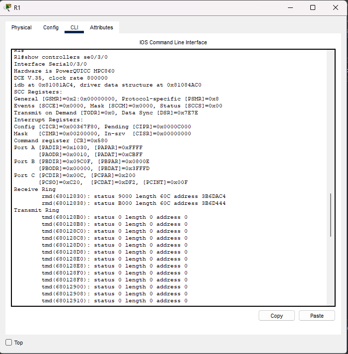
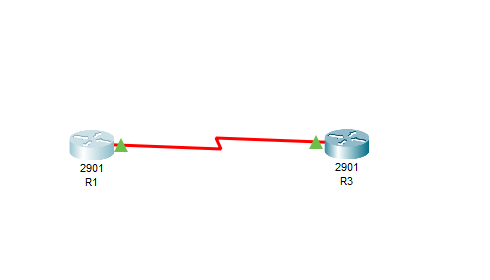

# Lab 1 – Configure, Verify, and Troubleshoot IPv4 Addresses

This lab introduces foundational IPv4 interface configuration and verification on Cisco routers using Packet Tracer.  
All interface mappings use the Cisco 2901 platform with HWIC-2T modules, which results in the serial interfaces appearing as Serial0/3/0 and Serial0/3/1.

---

## 📡 Topology



*Devices Used*
- 2 × Cisco 2901 routers  
- Serial link between:
  - R1 → Serial0/3/0  
  - R3 → Serial0/3/1  

---

## 🎯 Objectives

- Configure hostnames  
- Configure IPv4 addresses on serial interfaces  
- Configure loopback interfaces  
- Verify interface states and IPv4 addressing  
- Troubleshoot Layer-1/Layer-2 connectivity  

---

## 🛠 Step 1 — Configure Hostnames

### *R1*

```bash
conf t
hostname R1
end
```
### *R3*

```bash
conf t
hostname R3
end
```

## 🛠 Step 2 — Configure Serial Interfaces
### *R1* – *Serial0/3/0*


```bash
conf t
interface se0/3/0
 ip address 172.16.1.1 255.255.255.192
 clock rate 800000! 
 no shutdown
end
```
### *R3* - *Serial0/3/1*


```bash
conf t
interface se0/3/1
 ip address 172.16.1.2 255.255.255.192
 no shutdown
end
```
## 🛠 Step 3 — Configure Loopback Interfaces (R3)

```bash
conf t
interface loopback10
 ip address 10.10.10.3 255.255.255.128

interface loopback20
 ip address 10.20.20.3 255.255.255.224

interface loopback30
 ip address 10.30.30.3 255.255.255.248
end
```

## 🔍 Step 4 — Verification

After configuring hostnames, serial interfaces, and loopbacks, verify the IPv4 configuration and interface statuses using the following commands.


## ✅ 4.1 — Verify All Interface IP Addresses

Run on R3: 
```bash
show ip interface brief
```


## ✅ 4.2 — Verify Serial Interface Details (R1 or R3)

This command shows:
	•	Line protocol status
	•	Encapsulation (HDLC)
	•	Interface speed
	•	IP address + mask
	•	DCE/DTE role (if applicable)

Run on R1 or R3:
```bash
show interface se0/3/0
```


## ✅ 4.3 — Optional: Check DCE/DTE End

This confirms which router needs the clock rate.

Run:
```bash
show controllers serial 0/3/0
```


## 🧩 Step 5 — Troubleshooting

Below are common issues encountered in IPv4 interface configuration and how to resolve them.

1. Serial interface shows “down/down”

Cause: No clock rate applied on the DCE side
Fix:
```bash
show controllers serial 0/3/0
conf t
interface se0/3/0
 clock rate 800000
 no shutdown
```
2. Serial interface shows “up/down” (line protocol down)

Cause:
	•	Incorrect subnet mask
	•	Mismatched IP addressing
	•	Wrong cable orientation

Fix:
Verify addressing on both routers:
```bash
show run | section interface s
```
Re-enter the correct mask.

3. Loopback interface does not appear “up”

Cause: Mis-typed interface number or IP
Fix:
```bash
conf t
interface loopbackXX
 ip address X.X.X.X MASK
```
4. Cannot ping between routers

Cause:
	•	Interface shutdown
	•	Wrong IP
	•	Wrong serial interface number

Fix:
Check:
```bash
show ip interface brief
```
5. Wrong interface numbering (Packet Tracer vs real routers)

Cause: Different HWIC slot used
Packet Tracer uses:
	•	Serial0/3/0
	•	Serial0/3/1

instead of Serial0/0.

Fix:
Adjust commands to match the actual interface names shown in Packet Tracer.

## 📘 Step 6 — What I Learned


This lab helped reinforce several key IPv4 engineering concepts:
	•	How to configure IPv4 addresses on Cisco routers
	•	How Packet Tracer maps serial interfaces differently (0/0 vs 0/3/0)
	•	How to correctly apply subnet masks and interface IP addresses
	•	How to activate interfaces using no shutdown
	•	How to verify configurations using:
	•	show ip interface brief
	•	show interface SERIAL
	•	show controllers serial
	•	How to troubleshoot Layer-1 and Layer-2 issues on serial links
	•	How to document labs professionally for GitHub, including code blocks + screenshots
	•	How to structure a lab report recruiters can easily read and understand


