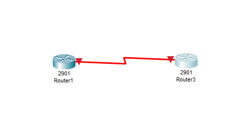
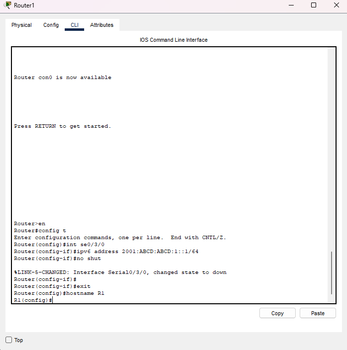
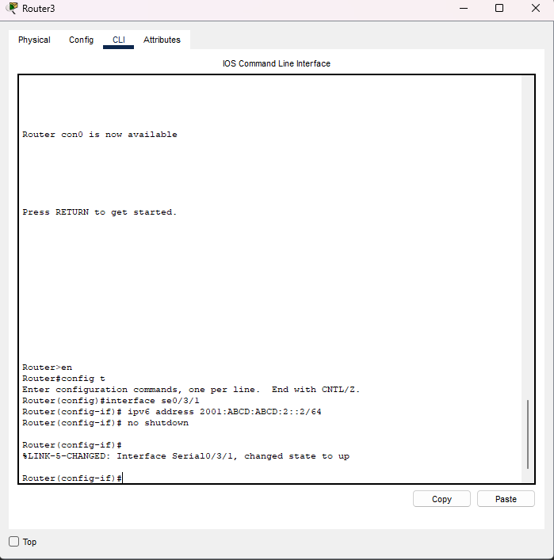

# Lab 2 — Configure, Verify, and Troubleshoot IPv6 Addresses
**CAINO Phase 1 – Week 1**  
**Engineer:** Ronique Young  
**Platform:** Packet Tracer  
**Routers:** R1 (Se0/3/0), R3 (Se0/3/1)

---

# 📘 Lab Objective
The objective of this lab is to configure IPv6 addressing on Serial and Loopback interfaces, verify IPv6 status, and troubleshoot IPv6 issues.  
This lab reuses the same interfaces from Lab 1.

---

# 🧠 Lab Purpose
IPv6 addressing is a core networking skill.  
This lab ensures you can:

- Enable IPv6 routing  
- Assign IPv6 addresses  
- Verify IPv6 using show commands  
- Troubleshoot IPv6 link and prefix issues  
- Document everything professionally for GitHub  

---

# 🖥️ Topology Diagram
Below is the topology used for this lab.  
Upload your topology screenshot to the `screenshots` folder, then update the filename below.



---

# 🔧 Step 3 — Configure IPv6 on Serial Interfaces

### R1 — Serial0/3/0


```bash
interface se0/3/0
 ipv6 address 2001:ABCD:ABCD:1::1/64
 no shutdown
```


### R3 - Serial0/3/1


```bash
interface se0/3/1
 ipv6 address 2001:ABCD:ABCD:2::2/64
 no shutdown
```

---

# 🔧 Step 4 — Configure IPv6 on Loopback Interfaces

### R1 — Loopback0
```bash
interface loopback0
 ipv6 address 2001::5/64
```
### R3 - Loopback0
```bash
interface loopback0
 ipv6 address 2001::5/64
```


