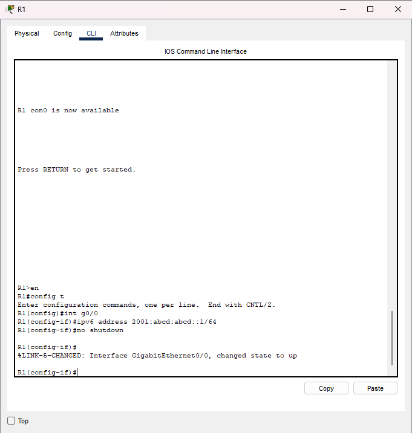
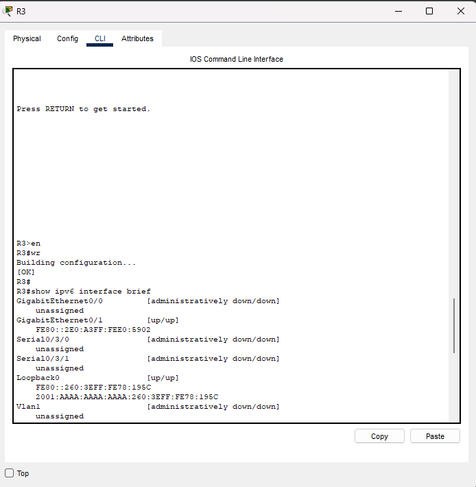
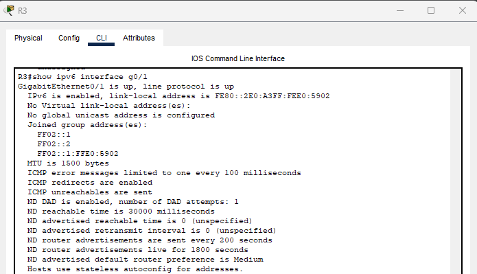
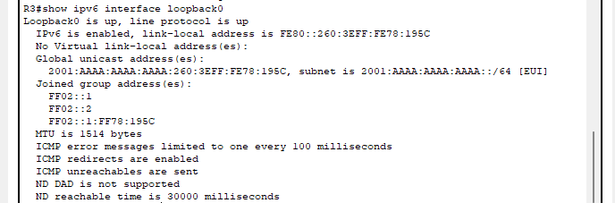

# Lab 03 – IPv6 SLAAC & EUI-64 Addressing  
*CAINO Phase:* 1  
*Week:* 1  
*Category:* IPv6 Fundamentals  
*Source:* 101 Labs – CCNA Lab 3  

---

## 🎯 Purpose  
Configure IPv6 Stateless Address Autoconfiguration (SLAAC) on R3 and manual IPv6 addressing on R1.  
Configure EUI-64 addressing on R3 Loopback0 and verify IPv6 address generation.

---

## 🧪 Tasks  
1. Configure hostnames on R1 and R3  
2. Enable IPv6 unicast routing  
3. Assign manual IPv6 address to R1 G0/0  
4. Configure SLAAC on R3 G0/1  
5. Configure EUI-64 address on R3 Loopback0  
6. Verify IPv6 addressing with show commands  

---

## 🧩 Topology


---

## 🛠 Configuration  

### 🔵 R1 Configuration  

```bash
conf t
hostname R1
ipv6 unicast-routing

interface g0/0
 ipv6 address 2001:abcd:abcd::1/64
 no shutdown
end
wr
```

### 🔵 R3 Configuration
```bash
conf t
hostname R3
ipv6 unicast-routing

interface g0/1
 ipv6 address autoconfig
 no shutdown

interface loopback0
 ipv6 address 2001:aaaa:aaaa:aaaa::/64 eui-64
end
wr
```
### 🔍 Verification Commands
## 📸 Screenshots  

### R1 IPv6 Interface Configuration  


### IPv6 Interface Brief (R3)  

```bash
show ipv6 interface brief
```

### R3 G0/1 IPv6 Interface Details  

```bash
show ipv6 interface g0/1
```

### R3 Loopback0 EUI-64 IPv6 Address  

```bash
show ipv6 interface loopback0
```
### R3 Running Configuration  

```bash
show running-config
```

